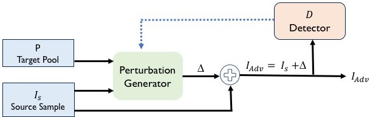

:warning: :warning: :warning: Experimental - **PLEASE BE CAREFUL**. Intended for Reasearch purposes ONLY. :warning: :warning: :warning:

This repository contains code and data of the paper ***Mockingbird*: Defending Against Deep-Learning-Based Website Fingerprinting Attacks with Adversarial Traces**, published in **IEEE Transactions on Information Forensics and Security (TIFS)**. Early access version of the paper is available at [IEEE Xplore](https://ieeexplore.ieee.org/document/9265277). You can also read the [arXiv version](https://arxiv.org/abs/1902.06626). *Mockingbird* is designed to work against deep-learning-based website fingerprinting attacks. Extensive evaluation shows that *Mockingbird* is effective against both white-box and black-box attacks including a more advanced intersection attacks.




#### Reference Format
```
    @article{rahman2020mockingbird,
          title={{Mockingbird:Defending Against Deep-Learning-Based Website Fingerprinting Attacks
                  with Adversarial Traces}}, 
          author={M. S. {Rahman} and M. {Imani} and N. {Mathews} and M. {Wright}},
          journal={IEEE Transactions on Information Forensics and Security},      
          year={2020},
          doi={10.1109/TIFS.2020.3039691}
    }
```

### Dependencies & Required Packages
Ensuring all the depencies is critical. It is hard to keep all the packages updated at once. Some versions might be relaitvely old.
So we suggest the users to create a `python virtual environment` or `conda environment` and install the required packages.

Please make sure you have all the dependencies available and installed.

- NVIDIA GPU should be installed in the machine, running on CPU will significantly increase time complexity.
- Ubuntu 16.04.5/ CentOS Linux 7 
- Python3-venv/ conda
- Keras version: 2.2.4
- TensorFlow version: 1.15.0
- Numpy: 1.16.6
- Matplotlib: 2.2.5
- CUDA Version: 10.2 
- CuDNN Version: 7 
- Python Version: 2.7.5

-- Please install the required packages using the following command:
`pip install -r requirements.txt`

### Dataset
We have shared the processed data using a Google Drive. Please download the processed data from this Google Drive [URL](https://drive.google.com/drive/folders/10rdGknCtp6KF75DXRTvS-mle4wj9Q_vD?usp=sharing).
After downloading, please put the data into the `dataset` directory.


### Adversarial Trace Generation using *Mockingbird*
Arguments:

           - `--data_dir`    : dataset directory.
           - `--data_type`   : choices= ['full_duplex', 'half_duplex']
           -  `--detector`    : choices = ['DF', 'AWF']\
                                detector model. DF as a detector will enable white-box attack\
                                and AWF as a detector will enable black-box attack.
           -  `--case`        : choices=[1,2]\
                                number of cases to run.
           - `--target_pool` : number of samples in the target pool.
           - `--num_iteration` : number of iterations to generate the adversarial trace.
      
                
Example of Usage:\
    ```
    python mockingbird.py --data_dir dataset --data_type full_duplex --detector DF --case 1 --target_pool 1 --num_iteration 1
    ```

### Running Attack with Adversarial Training
Arguments:

           - `--data_dir`    : dataset directory.
           - `--data_type`   : choices= ['full_duplex', 'half_duplex']
           -  `--detector`    : choices = ['DF', 'AWF']\
                                detector model. DF as a detector will enable white-box attack\
                                and AWF as a detector will enable black-box attack.
           -  `--case`        : choices=[1,2]\
                                number of cases to run.
           - `--target_pool` : number of samples in the target pool.
           - `--num_iteration` : number of iterations to generate the adversarial trace.
           - `--exp_type`    : choices = ['Undefended', 'Defended']\
                                Select Experiment Type to run: defended/undefended.
           - `--intersection_attack`   : choices= [True, False]
           - `--multi_gpu`    : choices= [True, False]
           - `--num_gpu`      : number of gpus.
           - `--optimizer`    : choices = ['Adam', 'Adamax']\
                                The optimizer for the experiment.
           - `--batch_size`   : choices = [32, 50, 64, 128, 256]\
                                The batch size for the experiment.
           - `--verbose`   : choices = [0, 1, 2]
           - `--learning_rate`   : learning rate of the optimizer.
      

Example of Usage:\
    ```
     CUDA_VISIBLE_DEVICES=0 python run_attack.py --data_dir dataset --data_type full_duplex --detector DF --case 1 --target_pool 1 --num_iteration 1 --exp_type Defended --intersection_attack False --attack_model DF --optimizer Adamax --epoch 2 --batch_size 128 --verbose 1 --learning_rate 0.001
    ```


### Information Leakage Analysis
Plesae refer to this [repository](https://github.com/notem/reWeFDE) for the code of the information leakage analysis.


### Questions, Comments, & Feedback
Please, address any questions, comments, or feedback to the authors of the paper.
The main developers of this code are:
 
* Mohammad Saidur Rahman ([saidur.rahman@mail.rit.edu](mailto:saidur.rahman@mail.rit.edu)) 
* Mohsen Imani ([imani.moh@gmail.com](mailto:imani.moh@gmail.com))
* Nate Mathews ([nate.mathews@mail.rit.edu](mailto:nate.mathews@mail.rit.edu))
* Matthew Wright ([matthew.wright@rit.edu](mailto:matthew.wright@rit.edu))


### Acknowledgements
This material is based upon work supported in part by the **National Science Foundation (NSF)** under Grants No. **1423163**, **1722743**, **1816851**, and **1433736**.
